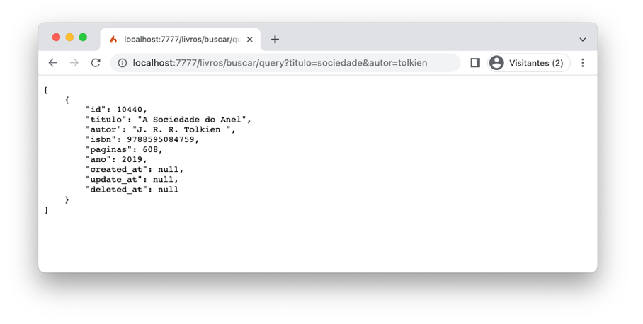
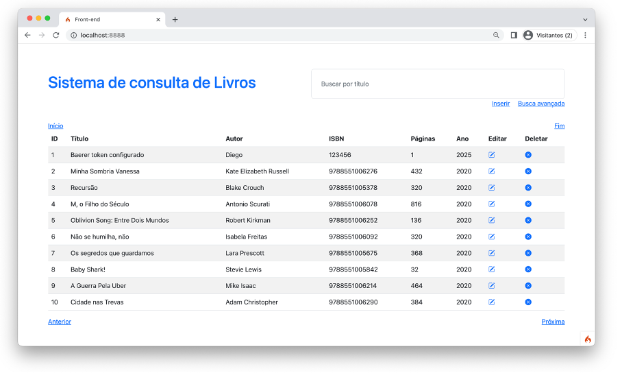

# Sistema de consulta de livros
Este repositório apresenta um sistema de consulta de livros construído usando CodeIgniter versão 4. Para uma melhor organização, este código foi dividido em dois sistemas com instalações CodeIgniter distintas:  

- **backend:** contém os códigos referentes a API back-end que realiza consultas, inserções, deleções e edições de metadados de livros em um banco de dados SQLite.  

 

- **frontend:** contém os códigos referentes às interfaces de usuários que consulta a API back-end. 

